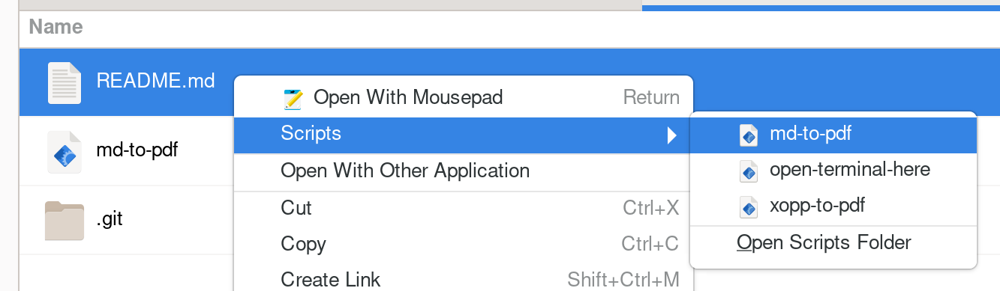

# md-to-pdf

To be able to convert one or more Markdown (`.md`) files to pdf, save [md-to-pdf](md-to-pdf) in `"$HOME"/.local/share/nautilus/scripts/md-to-pdf` and make it executable.

Screenshot of the context menu in Nautilus (GNOME files):

As an example, one can have a look at this README file converted to pdf: [README.md.pdf](./README.md.pdf)
